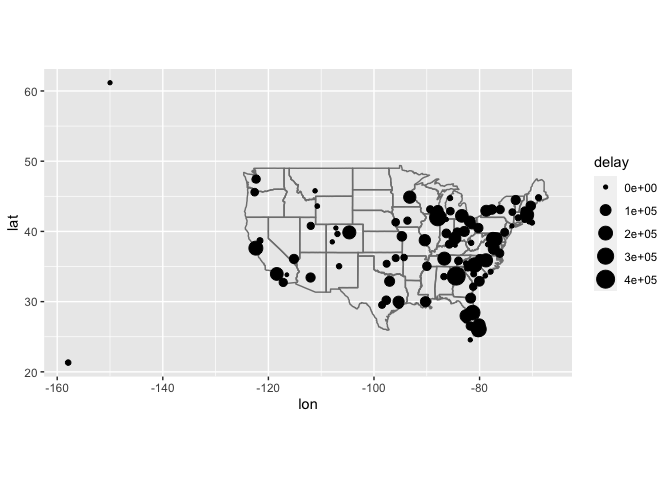

Relational Data Assignment
================

##### Assignment Instructions

Complete all questions below. After completing the assignment, knit your
document, and download both your .Rmd and knitted output. Upload your
files for peer review.

For each response, include comments detailing your response and what
each line does. Ensure you test your functions with sufficient test
cases to identify and correct any potential bugs.

##### Required Libraries

``` r
library(tidyverse)
```

    ## ── Attaching packages ─────────────────────────────────────── tidyverse 1.3.2 ──
    ## ✔ ggplot2 3.3.6     ✔ purrr   0.3.4
    ## ✔ tibble  3.1.7     ✔ dplyr   1.0.9
    ## ✔ tidyr   1.2.0     ✔ stringr 1.4.0
    ## ✔ readr   2.1.2     ✔ forcats 0.5.1
    ## ── Conflicts ────────────────────────────────────────── tidyverse_conflicts() ──
    ## ✖ dplyr::filter() masks stats::filter()
    ## ✖ dplyr::lag()    masks stats::lag()

``` r
library(babynames)
library(Lahman)
library(nasaweather)
```

    ## 
    ## Attaching package: 'nasaweather'
    ## 
    ## The following object is masked from 'package:dplyr':
    ## 
    ##     storms

``` r
library(nycflights13)
```

##### Question 1.

Identify the primary keys in the following datasets. Be sure to show
that you have the primary key by showing there are no duplicate entries.

Lahman::Batting babynames::babynames nasaweather::atmos

``` r
Batting %>% count(playerID, yearID, teamID) %>%
   head(n=5)
```

    ##    playerID yearID teamID n
    ## 1 aardsda01   2004    SFN 1
    ## 2 aardsda01   2006    CHN 1
    ## 3 aardsda01   2007    CHA 1
    ## 4 aardsda01   2008    BOS 1
    ## 5 aardsda01   2009    SEA 1

``` r
babynames %>% count(year, name, sex) %>% head(n=5)
```

    ## # A tibble: 5 × 4
    ##    year name   sex       n
    ##   <dbl> <chr>  <chr> <int>
    ## 1  1880 Aaron  M         1
    ## 2  1880 Ab     M         1
    ## 3  1880 Abbie  F         1
    ## 4  1880 Abbott M         1
    ## 5  1880 Abby   F         1

``` r
atmos %>% count(year, month, lat, long) %>%
  head(n=5)
```

    ## # A tibble: 5 × 5
    ##    year month   lat  long     n
    ##   <int> <int> <dbl> <dbl> <int>
    ## 1  1995     1 -21.2 -114.     1
    ## 2  1995     1 -21.2 -111.     1
    ## 3  1995     1 -21.2 -109.     1
    ## 4  1995     1 -21.2 -106.     1
    ## 5  1995     1 -21.2 -104.     1

##### Question 2.

What is the relationship between the “Batting”, “Master”, and “Salaries”
tables in the “Lahman” package? What are the keys for each dataset and
how do they relate to each other?

``` r
# No Master table

# yearID teamID lgID  playerID are the COMPOSITE key of table Salaries
Batting %>% inner_join(Salaries, by = c("yearID", "playerID", "lgID", "teamID")) %>% head(n=5)
```

    ##    playerID yearID stint teamID lgID  G  AB  R  H X2B X3B HR RBI SB CS BB SO
    ## 1 ackerji01   1985     1    TOR   AL 61   0  0  0   0   0  0   0  0  0  0  0
    ## 2 agostju01   1985     1    CHA   AL 54   0  0  0   0   0  0   0  0  0  0  0
    ## 3 aguaylu01   1985     1    PHI   NL 91 165 27 46   7   3  6  21  1  0 22 26
    ## 4 alexado01   1985     1    TOR   AL 36   0  0  0   0   0  0   0  0  0  0  0
    ## 5 allenne01   1985     1    SLN   NL 23   2  0  0   0   0  0   0  0  0  0  2
    ##   IBB HBP SH SF GIDP salary
    ## 1   0   0  0  0    0 170000
    ## 2   0   0  0  0    0 147500
    ## 3   5   6  4  3    7 237000
    ## 4   0   0  0  0    0 875000
    ## 5   0   0  0  0    0 750000

##### Question 3.

Load the “nycflights13” library. Use an appropriate join to add a column
containing the airline name to the “flights” dataset present in the
library. Be sure to put the carrier code and name in the first two
columns of the result so we can see them. Save the result as “flights2”.

``` r
flights2 <- flights %>% inner_join(airlines, by = c("carrier")) %>%
    select("carrier", "carrier_name" = "name", everything())
flights2
```

    ## # A tibble: 336,776 × 20
    ##    carrier carrier_n…¹  year month   day dep_t…² sched…³ dep_d…⁴ arr_t…⁵ sched…⁶
    ##    <chr>   <chr>       <int> <int> <int>   <int>   <int>   <dbl>   <int>   <int>
    ##  1 UA      United Air…  2013     1     1     517     515       2     830     819
    ##  2 UA      United Air…  2013     1     1     533     529       4     850     830
    ##  3 AA      American A…  2013     1     1     542     540       2     923     850
    ##  4 B6      JetBlue Ai…  2013     1     1     544     545      -1    1004    1022
    ##  5 DL      Delta Air …  2013     1     1     554     600      -6     812     837
    ##  6 UA      United Air…  2013     1     1     554     558      -4     740     728
    ##  7 B6      JetBlue Ai…  2013     1     1     555     600      -5     913     854
    ##  8 EV      ExpressJet…  2013     1     1     557     600      -3     709     723
    ##  9 B6      JetBlue Ai…  2013     1     1     557     600      -3     838     846
    ## 10 AA      American A…  2013     1     1     558     600      -2     753     745
    ## # … with 336,766 more rows, 10 more variables: arr_delay <dbl>, flight <int>,
    ## #   tailnum <chr>, origin <chr>, dest <chr>, air_time <dbl>, distance <dbl>,
    ## #   hour <dbl>, minute <dbl>, time_hour <dttm>, and abbreviated variable names
    ## #   ¹​carrier_name, ²​dep_time, ³​sched_dep_time, ⁴​dep_delay, ⁵​arr_time,
    ## #   ⁶​sched_arr_time
    ## # ℹ Use `print(n = ...)` to see more rows, and `colnames()` to see all variable names

##### Question 4.

Use an appropriate join to add the airport name to the “flights2”
dataset you got above. The codes and names of the airports are in the
“airports” dataset of the “nycflights13” package. Put the carrier and
carrier name first followed by the destination and destination name,
then everything else.

``` r
flights2 %>% inner_join(airports, by = c("dest" = "faa")) %>%
    select("carrier", "carrier_name", "dest", "dest_name"= "name", everything())
```

    ## # A tibble: 329,174 × 27
    ##    carrier carrier_name  dest  dest_…¹  year month   day dep_t…² sched…³ dep_d…⁴
    ##    <chr>   <chr>         <chr> <chr>   <int> <int> <int>   <int>   <int>   <dbl>
    ##  1 UA      United Air L… IAH   George…  2013     1     1     517     515       2
    ##  2 UA      United Air L… IAH   George…  2013     1     1     533     529       4
    ##  3 AA      American Air… MIA   Miami …  2013     1     1     542     540       2
    ##  4 DL      Delta Air Li… ATL   Hartsf…  2013     1     1     554     600      -6
    ##  5 UA      United Air L… ORD   Chicag…  2013     1     1     554     558      -4
    ##  6 B6      JetBlue Airw… FLL   Fort L…  2013     1     1     555     600      -5
    ##  7 EV      ExpressJet A… IAD   Washin…  2013     1     1     557     600      -3
    ##  8 B6      JetBlue Airw… MCO   Orland…  2013     1     1     557     600      -3
    ##  9 AA      American Air… ORD   Chicag…  2013     1     1     558     600      -2
    ## 10 B6      JetBlue Airw… PBI   Palm B…  2013     1     1     558     600      -2
    ## # … with 329,164 more rows, 17 more variables: arr_time <int>,
    ## #   sched_arr_time <int>, arr_delay <dbl>, flight <int>, tailnum <chr>,
    ## #   origin <chr>, air_time <dbl>, distance <dbl>, hour <dbl>, minute <dbl>,
    ## #   time_hour <dttm>, lat <dbl>, lon <dbl>, alt <dbl>, tz <dbl>, dst <chr>,
    ## #   tzone <chr>, and abbreviated variable names ¹​dest_name, ²​dep_time,
    ## #   ³​sched_dep_time, ⁴​dep_delay
    ## # ℹ Use `print(n = ...)` to see more rows, and `colnames()` to see all variable names

##### Question 5.

The “nycflights13” library and the code to create spatial map is
provided for you. Now compute the average delay by destination, then
join on the airports dataframe so you can show the spatial distribution
of delays.

-   Use the size or colour of the points to display the average delay
    for each airport.
-   Add the location of the origin and destination (i.e. the lat and
    lon) to flights.
-   Compute the average delay by destination.

Use the textbook for reference.

``` r
library(nycflights13)
    
flights %>%
  group_by(dest) %>% 
  summarise(
    delay = sum(dep_delay, na.rm = TRUE) + sum(arr_delay,na.rm = TRUE)
  )  %>% 
  inner_join(airports, by = c("dest" = "faa")) %>%
  select("dest", "dest_name"= "name", everything()) %>%
  ggplot(aes(lon, lat)) +
    borders("state") +
    geom_point(aes(size=delay)) +
    coord_quickmap()
```

<!-- -->

##### Question 6.

Use a set operation function to find which airport codes from flights
are not in the airports dataset.

``` r
setdiff(flights[["dest"]],airports[["faa"]])
```

    ## [1] "BQN" "SJU" "STT" "PSE"
