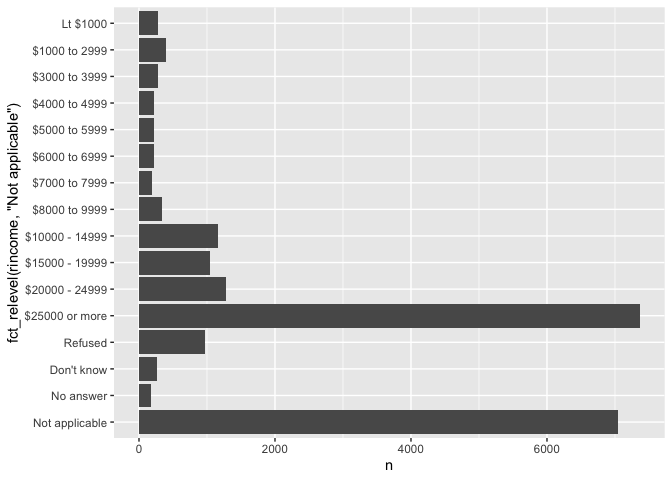
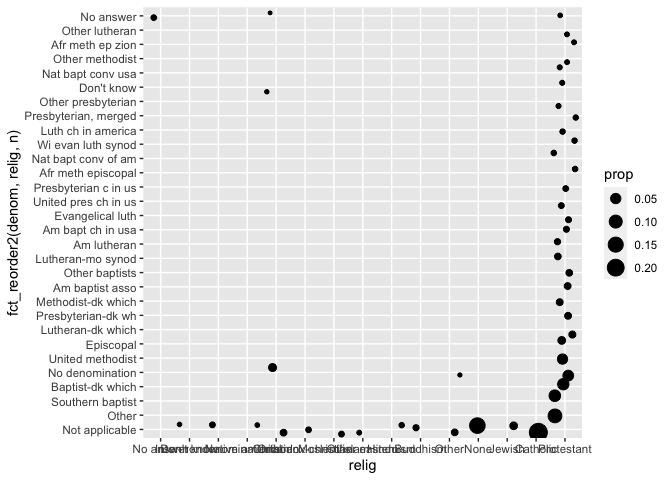
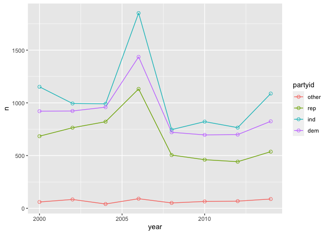
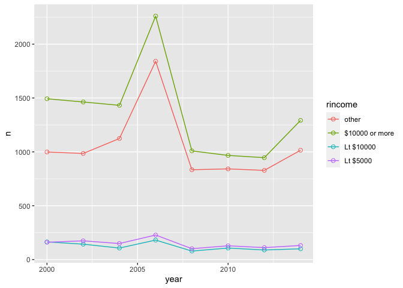

Categorial Variables and Factors Assignment
================

# Please complete all the tasks listed below. After completing the tasks download the .Rmd file and upload in the peer review item for grading.

# Additionally please write text between the code chunks explaining what each code chunk is about.

# Refer the linked online textbook in case of any issues.

Load the stringr and forcats library

``` r
library(stringr)
library(forcats)
library(tidyverse)
```

    ## ── Attaching packages ─────────────────────────────────────── tidyverse 1.3.2 ──
    ## ✔ ggplot2 3.3.6     ✔ readr   2.1.2
    ## ✔ tibble  3.1.7     ✔ purrr   0.3.4
    ## ✔ tidyr   1.2.0     ✔ dplyr   1.0.9
    ## ── Conflicts ────────────────────────────────────────── tidyverse_conflicts() ──
    ## ✖ dplyr::filter() masks stats::filter()
    ## ✖ dplyr::lag()    masks stats::lag()

1.From the “forcats” library load gss_cat data. Explore the distribution
of rincome (reported income). What makes the default bar chart hard to
understand? How could you improve the plot?

``` r
gss_cat %>%
  count(rincome)  %>%
  ggplot(aes(n,fct_relevel(rincome, "Not applicable"))) + 
    geom_col()
```

<!-- -->

2.  What is the most common religion? What is the most common partyid?

``` r
gss_cat %>%
  count(relig) %>%
  arrange(desc(n)) %>% 
  head(1)
```

    ## # A tibble: 1 × 2
    ##   relig          n
    ##   <fct>      <int>
    ## 1 Protestant 10846

``` r
gss_cat %>%
  count(partyid) %>%
  arrange(desc(n)) %>% 
  head(1)
```

    ## # A tibble: 1 × 2
    ##   partyid         n
    ##   <fct>       <int>
    ## 1 Independent  4119

3.Which relig does denom (denomination) apply to? How can you find out
with a table? How can you find out with a visualisation?

``` r
df <- gss_cat %>%
  select(denom,relig) %>%
  group_by(denom,relig) %>%
  summarise(
    n=n()
  ) %>% 
  ungroup()
```

    ## `summarise()` has grouped output by 'denom'. You can override using the
    ## `.groups` argument.

``` r
sum_n = sum(df$n)

df <- df %>%
  mutate(prop = n / sum_n)

df %>% 
  ggplot(mapping=aes(relig, fct_reorder2(denom,relig,n), size=prop)) +
    geom_point(position="jitter")
```

<!-- -->

4.How have the proportions of people identifying as Democrat,
Republican, and Independent changed over time? Plot a suitable chart.

``` r
gss_cat_collapse <- gss_cat %>%
  mutate(partyid = fct_collapse(partyid,
                                other = c("No answer","Don't know","Other party"),
                                rep = c("Strong republican","Not str republican"),
                                ind = c("Ind,near rep","Independent","Ind,near dem"),
                                dem = c("Not str democrat","Strong democrat")))


gss_cat_collapse %>%
  group_by(year) %>%
  count(partyid) %>%
  ggplot(aes(year,n,color = partyid))+
  geom_line()+
  geom_point(size = 2, shape= 1)
```

<!-- -->

5.Collapse “rincome” into smaller set of categories?

``` r
gss_cat_collapse <- gss_cat %>%
  mutate(rincome = fct_collapse(rincome,
                                other = c("No answer","Don't know","Refused","Not applicable"),
                                "Lt $5000" = c("Lt $1000","$1000 to 2999","$3000 to 3999","$4000 to 4999"),
                                "Lt $10000" = c("$5000 to 5999","$6000 to 6999","$7000 to 7999","$8000 to 9999"),
                                "$10000 or more" = c("$10000 - 14999","$15000 - 19999","$20000 - 24999","$25000 or more"))) 

gss_cat_collapse %>%
  group_by(year) %>%
  count(rincome) %>%
  ggplot(aes(year,n,color = rincome))+
  geom_line()+
  geom_point(size = 2, shape= 1)
```

<!-- -->
